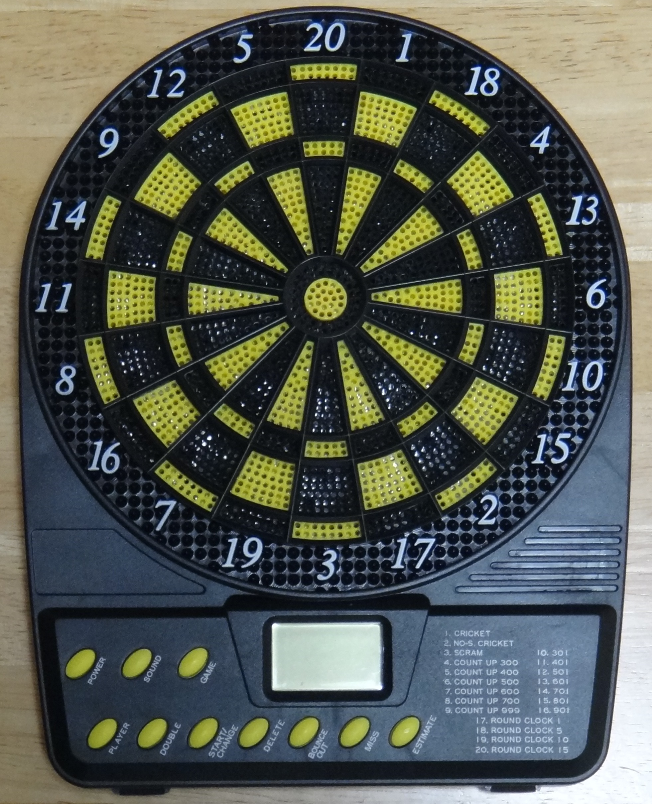
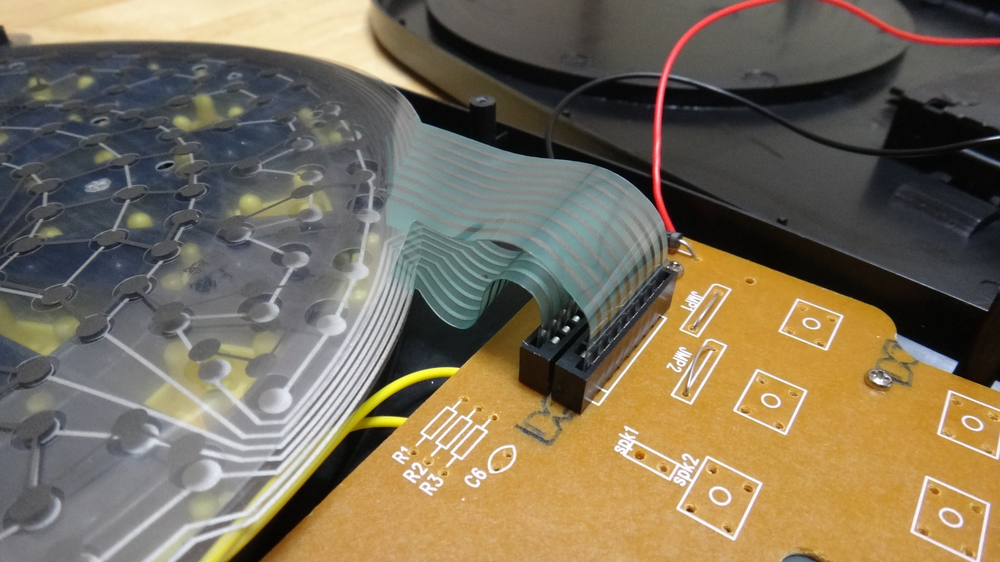

## dartsduino    <!-- class: 'slide' -->

寺戸 育夫

## 自己紹介    <!-- class: 'slide' -->

* 所属
* 関わった商品

## 背景    <!-- class: 'slide', dx: 0, dy: 0 -->

### Web とリアルをつなげる    <!-- class: 'slide', tx: -250, scale: 0.25 -->

### GitFab                  <!-- class: 'slide', scale: 0.25 -->

### 中高生への良い刺激        <!-- class: 'slide', tx: 250, scale: 0.25 -->

##     <!-- dx: 1500, dy: 0 -->

## 考えた要素    <!-- class: 'slide' -->

* 物理的な何かとのインタラクション
* 集合知の活用
  * ソフトウエア・ハードウェアの派生
  * 制作過程の派生
* 安価、簡易

## dartsduino    <!-- class: 'slide' -->

 
<_iframe id='player' type='text/html' width='720' height='500'
  src='http://www.youtube.com/embed/sHt_5in-ziQ'
  frameborder='0' class='center'>
</_iframe>

## 構成要素    <!-- class: 'slide' -->

* GitHub
  * dartsduino
     * darts-ui
     * dartsduino-games-countup
     * dartsduino-games-x01  
  * dartsduino-firefox-addon
  * dartsduino-sketch
* GitFab
  * dartsduino-hw

##     <!-- x: 0, y: 2000, z: -10, rotate-y: 180 -->

##     <!-- x: 0, y: 2000, z: 0, dx: 0, dy: 0, dz: 200 -->

##     <!-- rotate-x: -70, rotate-y: -45, dx: 0, dy: 0, dz: 0 -->

  
  
  

##     <!-- x: 160, y: 2120, z: 0, rotate-x: -35, rotate-y: -70, rotate-z: 35, scale: 0.15 -->

## 動作の原理    <!-- x: 0, y: 3000, z: 0, class: 'slide', dx: 1500, dy: 0, dz: 0 -->

## 回路図    <!-- class: 'slide' -->

## Contributions 求む

* core のアーキテクチャ (dartsduino)
* UI のデザイン (dartsduino-ui)
* ゲーム gem (dartsduino-games-xxx)
* 効果音 (dartsduino, dartsduino-ui)
* Sketch (dartsduino-skecth)
* 回路 (dartsduino-hw)

